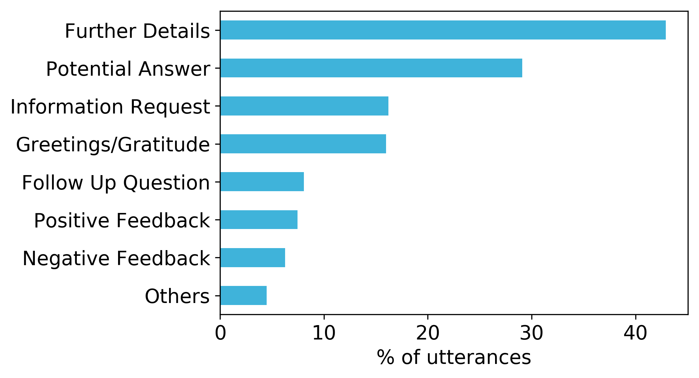

# MANtIS - a multi-domain information seeking dialogues datase
##### This repo contains the implementation for obtaining a conversational search dataset

## Introduction
The dataset contains conversations from the  community  question-answering portal [Stack Exchange](https://stackexchange.com)
as a starting point, given the fact that the data  dump  is  [publicly  available](https://archive.org/details/stackexchange),
it  is  large-scale (more than 20M questions), it covers diverse domains including
[DIY](https://diy.stackexchange.com/), [traveling](https://travel.stackexchange.com) and a range of IT and computer science 
domains (175 as of 05/2019). Moreover, the information needs are often complex as posing a question on Stack Exchange
usually means that a simple websearch is not enough to find a suitable answer.

For our version of the dataset,  we  consider  14  diverse  domains:

| Domain        | No. of dialogues |
|---------------|------------------|
| apple 	    | 5,645 		   |
| askubuntu     | 17,755		   |
| dba 	        | 5,197 		   |
| diy 	        | 1,528 		   |
| electronics   | 10,690 		   |
| english       | 3,231 		   |
| gaming        | 2,982 		   |
| gis 		    | 9,095 		   |
| physics 	    | 7,826 		   |
| scifi 		| 2,214 		   |
| security 	    | 3,752 		   |
| stats 		| 7,676 		   |
| travel 		| 1,433 		   |
| worldbuilding | 1,300 		   |

The restricting factor for our data collection effort is the manual utterance intent labeling process. However, 
the scripts can easily be extended with more sites.

In order to ensure that each conversation in our dataset follows our set of criteria, we have devised a list of six
conditions that must hold for each conversation:
1. The entire conversation takes place between _exactly_ two users (the asker who starts off the conversation and the answerer).
2. The conversation consists of _at least_ 2 turns per user.
3. At least one of the answerer’s utterances contains a hyperlink (providing grounding).
4. The  conversation has not been marked as _Spam_ or _Offensive_.
5. The  conversation has not been  edited or marked as deprecated.
6. If the final turn in the conversation belongs to the asker, it contains _positive feedback_ (identified using the
[vader score](https://www.nltk.org/_modules/nltk/sentiment/vader.html)).

The example below showcases 2 examples of conversations that are extracted after the entire processing pipeline is applied.

## Intent labels dataset
To further enrich the dataset, we have employed annotators to mark a subset of 1356 utterances from the dataset with intent labels. Throughout this dataset, you will encounter the following type of intents:

| Category	|	Description	|	Example snippet |
|-----------|---------------|-------------------|
| Further Details	|	A user (either asking or answering user) provides more details.	|	Hi. Sorry for taking so long to reply. The information you need is ...|
| Follow Up Question	|	Asking user asks one or more follow up questions about relevant issues.	|	Thanks. I really have one more simple question -- if I ...|
| Information Request	|	A user (either asking or answering user) is asking for clarifications or further information.	|	What is the make and model of the computer? Have you tried installing ... Your advice is not detailed enough. I'm not sure what you mean by ... |
| Potential Answer	|	A potential solution, provided by the answering user.	|	Hi. To change the PIN on your phone, you may follow the steps below:..|
| Positive Feedback	|	Asking user provides positive feedback about the offered solution.	|	Hi. That was exactly what I needed. Thanks!|
| Negative Feedback	|	Asking user provides negative feedback about the offered solution.	|	Thanks for you help! However, the fix did not work..|
| Greetings / Gratitude	|	A user (asking or answering user) offers a greeting or expresses gratitude.	|	Thank you for all the responses!|
| Other	|	Anything that does not fit into the above categories.	|	:) :) :) . *shrug*|

The distribution of labels across all annotated conversations is shown in the figure below, with Original Question, Potential Answer and Further Details being the most frequent labels. 21% of utterances were annotated with more than one label, indicating the multi-intent nature of our dataset.
<!---  --->

## Using the code
#### Installing dependencies
In order to install all the required external dependencies, please run `pip install -r requirements.txt` in the root folder of the project. 
We recommend using a virtual enviroment with Python >= 3.6.8. Python 2 is not supported.

For NLP, the project uses [spacy](https://spacy.io/) and the [en_core_web_sm](https://spacy.io/usage/models)
model. To download the model, please run `python -m spacy download en_core_web_sm`

#### Fetching the .xml files for each stackExchange site
As mentioned previously, we use StackExchange as it offers a public dump of its conversations. To fetch the initial
[stackExchange dump](https://archive.org/details/stackexchange), you need to run the `fetch_stackexchange_dump.sh` script, which
is located in the root folder of the project. This will create a folder called `stackexchange_dump` and will put all the `.xml`
files there. During the process, it might ask to install a utility to unzip `.7z` files. 
However, the downloaded `.xml` files are in a structure that makes it difficult to process conversations. For this reason,
we have taken inspiration from [MSDialog's](https://ciir.cs.umass.edu/downloads/msdialog) JSON structure for their dataset and
created a pipeline that aggregates the XML data into a single JSON file.

#### Building the JSON dataset

To run the script that turns the XML dump into a JSON file similar to
[MSDialog - Complete](https://ciir.cs.umass.edu/downloads/msdialog/), you are required to run
(in the root folder) `python run.py json {topic}`, where `{topic}` is a supported
topic from StackExchange. The updated list of topics is being maintained
[here](https://github.com/alexanderblnf/conversational-search-dataset/wiki/Supported-Topics).
The output is stored in `stackexchange_dump/{topic}/data.json`. To obtain a set of datasets 
from a handpicked list of domains, please run use the `run.all.sh` script. 

In order to merge multiple json datasets into a **single, multi-domain dataset**, you are required
to run `python run.py merge {topic1},{topic2},{topic3}...{topicN}`, where `{topicX}` is a topic
for which there is already a constructed json dataset. The output is stored in 
`stackexchange_dump/merged_{allocation}.tsv`, where `{allocation}` is either train, dev or test.

##### JSON data format:

* __dialog_id__: a unique id for a dialog - ids are consecutive
* __category__: domain to which the dialogue belongs (for now, *Apple* is the only category)
* __title__: dialog title from the forum
* __dialog_time__: the time that the first utterance of the dialog was posted
* __utterances__: a list of utterances in this dialog
    * __actor_type__: *user* or *agent* (“user” refers to the information seeker that initiates the conversation. 
    All the other conversation participants are considered as “agents”)
    * __utterance_pos__: the utterance position in the dialog (starts from 1)
    * __utterance__: the content of the utterance
    * __votes__: number of votes the answer received from the community
    * __utterance_time__: the time that the utterance was posted
    * __is_answer__: whether the utterance is selected as the best answer by the community
    * __id__: the id of the original post/comment
     (for comments, the syntax is {post_id}_{comment_id})

#### Building the training datasets

The project also offers an utility that builds datasets to be used for training a neural network for response ranking. 
Firstly, each conversation is split into "contexts" that have at least 2 utterances per user. 

To run the script that turns the JSON file to a training dataset similar to 
[MSDialog - ResponseRank](https://ciir.cs.umass.edu/downloads/msdialog/), you need to run
`python run.py training [easy]`. Without specifying `easy`, the resulting dataset will contain
50 negative samples (*sampled from all domains*) for each true agent response. In case the flag is
specified, only 10 negative samples (*sampled from the same domain as the agent response*) will be
added for each true agent response. 
The output is stored in `stackexchange_dump/data_{allocation}.tsv`. A lookup `.txt` file is generated
for each file that contains for each row the ID of the original conversation in the source JSON.

##### .tsv data format:

`label \t utterance_1 \t utterance_2 \t ...... \t candidate_response`, where:
* `label` is 1 when the `candidate_response` is the true response and 0 when it is a negative sample
* `utterance_{x}` is a utterance of one of the 2 users
* `candidate_response` is the answer of the current context

